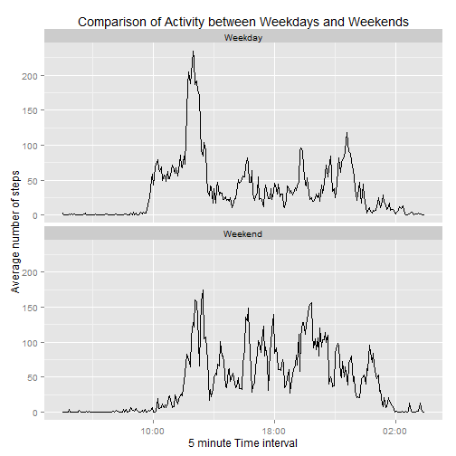

DailyActivityReport
===
author: Homer Simpson
date: July 22nd, 2015
transition: rotate

Introduction
===

This assigment makes use of data from personal activity monitoring devices like [FitBit](http://www.fitbit.com/), [Nike Fuelband](http://www.nike.com/us/en_us/c/nikeplus-fuel) and [Jawbone Up](https://jawbone.com/up). 

The devices collect data at 5-minute intervals throughout the day. The data coinsist of two months of data from an anonymous individual collected during the months of October and November 2012 and include the number of steps taken in 5-minute intervals each day. 

The dataset is stored in comma-separated-value (CSV) file and there are total of 17,568 observations in this dataset.
 
The variables included in this dataset are:
- **steps:** Number of steps taken in a 5-minute interval (missing values are coded as NA
- **date:** The date on which the measurement was taken in YYYY-MM-DD format
- **interval:** Identifier for the 5-minute interval in which measurement was taken.

Daily Activity Shiny App
===

Using the monitoring devices, there has been an abundance of data from individuals who take measurement about themselves regularly to improve their health, to find pattern in their behavior. However, these data remain under-utilized both because the raw data are hard to obtain, and there is a lack of statistical methods and software for processing and interpreting the data. 

I have created an interactive Shiny app,  that uses the entire data set to facilitate this. Using my Shiny app, one can run the simulation holistically using the entire data set. You then can run the same simulation just factoring in the week days and then later the weekends. This will help identify the pattern diference between weekdays and weekends. 

Hope you will use my app to get better insight into when this individual is more active and how a better workout plan can be devised based on this info.

You can access my Shiny App at the following link:
     [Daily Activity Shiny App](https://pvennel.shinyapps.io/DevelopingDataProducts)

Daily Activity plot
===

 

Conclusion
===

Based on the above plot, we see that there are more activities on Weekedays than Weekends between the hours of 5:00 am and 10:00 am. Also the peak of activity on Weekday is greater at this time period compared to Weekend.There is no or very little activity between 1:00 and 5:00 in both cases. Similarly the activity tapers off after 21:00 in both cases.

Most important the peak value during weekdays is much more than the peak values during the weekend. Without separating the data set into wekkdays and weekends, this would not have been discovered. 

<table border="1" >
<tr>
   <th>   </th>
   <th> Max Peak Value  </th>
   <th> Time of Day  </th>
</tr>
<tr>
   <td style = 'font-weight:bold'> Weekday  </td>
   <td style = 'text-align:center'> 235 steps </td>
   <td style = 'text-align:center'> 08:35 am </td>
</tr>
<tr>
   <td style = 'font-weight:bold'> Weekend  </td>
   <td style = 'text-align:center'> 175 steps </td>
   <td style = 'text-align:center'> 09:15 am </td>
</tr>
</table>
